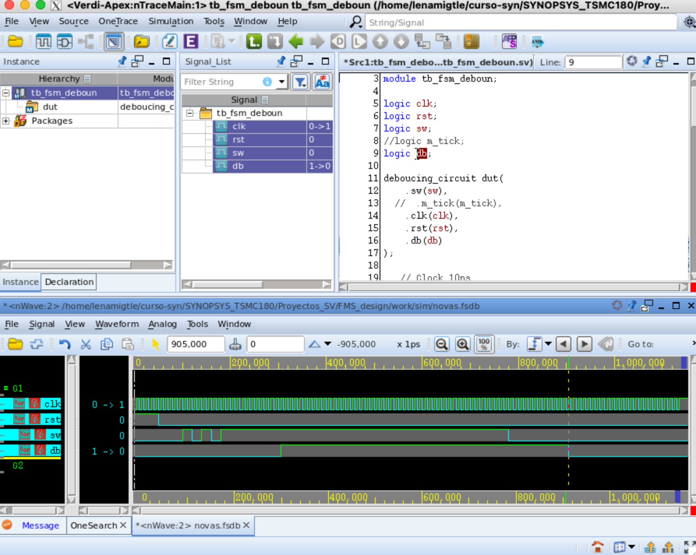

# deboucing_FSM
## FSM Design

In this project, I designed a debouncing circuit using an FSM with three always blocks:

- First always block for the state register  
- Second always block for the next-state logic  
- Third always block for the output logic  

## How does it work?

This design uses an FSM with 8 states. The main goal is to eliminate the bouncing effect that occurs when a mechanical switch is pressed. Any change in the `sw` signal (for example, from 0 to 1 or from 1 to 0) is considered valid only if the signal remains stable for 3 consecutive `m_tick` events.

### Command to configure Synopsys using a **Makefile**



```bash
setenv GIT_ROOT `git rev-parse --show-toplevel`
setenv UVM_WORK $GIT_ROOT/work/uvm
mkdir -p $UVM_WORK && cd $UVM_WORK
ln -sf $GIT_ROOT/hw/Makefile/Makefile.vcs Makefile
``` 


### Makefile
After completing these steps you will have the environmente ready to work. You can then use the Makefile with the following commands:
- make compile : Compiles the RTL and testbench files
- make sim : Runs the simulation and displays the signals
- make verdi : Opens the graphical interfacee

Of course, if you have any question o any problem you can write make var or make help to see where/what is the problem.
I add my email to connect with me if you requiered : namigtle066@gmail.com :)


